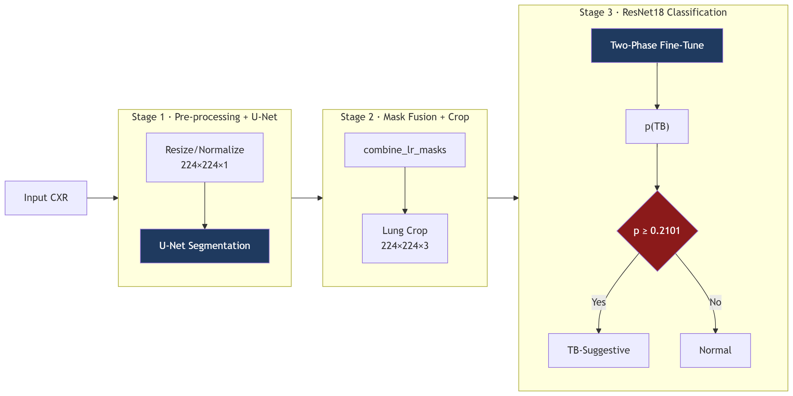
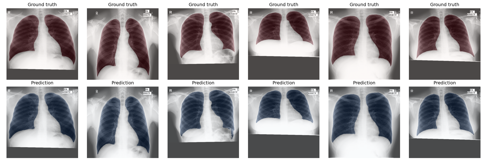
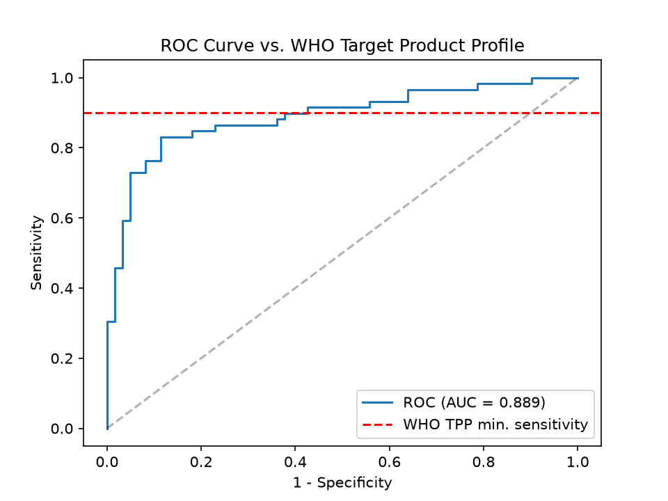
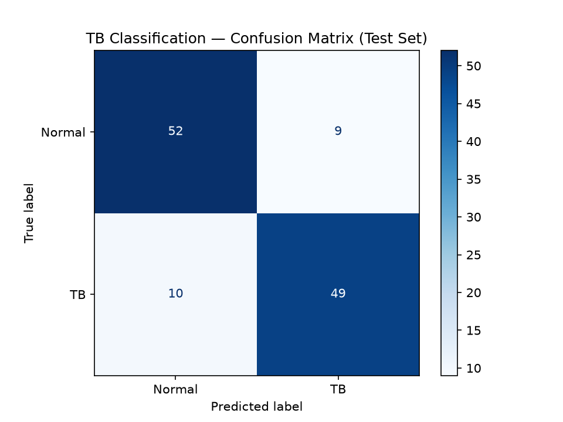

# TB-CXR Screening — Computer-Aided Tuberculosis Detection Pipeline

<p align="left">
  
  
  
  
  
</p>

Two-stage CAD pipeline for TB screening from chest X-rays. U-Net segments the lung field while a fine-tuned ResNet18 classifies the masked crop as TB-suggestive or normal. The pipeline is trained on Montgomery + Shenzhen (800 images) and served via Dockerized FastAPI, with tests and image publishing wired into CI/CD on every push to `main`.

---

## 1. Clinical Problem & WHO TPP

In high-TB-burden and low-resource settings, the bottleneck is radiologist time and not X-ray capacity. CAD triage tools give every scan an automated first pass: flag the subset that needs a human read, clear the rest.

The WHO's Target Product Profile (TPP) sets the bar for a deployable triage tool:

| Requirement | WHO TPP Target |
|---|---|
| Sensitivity | **≥ 90%** |
| Specificity | **≥ 70%** |

A missed TB case (false negative) costs a lot more than an unnecessary follow-up test (false positive) so the decision threshold gets tuned toward sensitivity, not accuracy. See Section 4 for how that plays out on this model.

## 2. Pipeline Architecture

<p align="center">
  
  <br />
  <b>Figure 1: End-to-end CAD pipeline architecture</b>
</p>

<br />

<p align="center">
  
  <br />
  <b>Figure 2: Ground truth (top) vs. U-Net predictions (bottom) across six test cases</b>
</p>

- **Stage 1 - Segmentation:** Raw CXR resized to 224×224, U-Net predicts left + right lung masks. Mask resize uses `cv2.INTER_NEAREST` to keep boundaries binary instead of blurred.
- **Stage 2 - Fusion & Crop:** `combine_lr_masks` merges both masks, crops the frame down to lung tissue only. Shoulders, clavicles, cardiac border — gone before the classifier ever sees them.
- **Stage 3 - Classification.** ResNet18, two-phase fine-tuned (frozen backbone → full unfreeze), outputs `p(TB)`. Threshold is **0.2101**, not 0.5 — tuned for sensitivity per Section 1.

Cost of this design: one extra inference pass per image (U-Net + ResNet18 instead of one model). Payoff: the classifier's input is constrained to lung tissue by construction, not by hoping the training data is diverse enough to teach it.

## 3. Data Preparation

Montgomery (USA) ships with NLM-native lung masks; Shenzhen (China) masks come from a separately published annotation set, not NLM's original release. This is worth knowing since the two are not annotated the same way. Splits are row-level, zero patient leakage and stratified by class and source.

**Dataset composition:**

| Source | Total | Normal | TB |
|---|---|---|---|
| Montgomery | 138 | 80 | 58 |
| Shenzhen | 662 | 326 | 336 |
| **Combined** | **800** | **406** | **394** |

**Splits** (`test_size=0.15`, `val_size=0.15`):

| Split | Total | Normal | TB |
|---|---|---|---|
| Train | 559 | 284 | 275 |
| Val | 121 | 61 | 60 |
| Test | 120 | 61 | 59 |

## 4. Training & Results

**Segmentation (U-Net):** Trained with DiceBCELoss $\rightarrow$ plain BCE underweights the foreground/background pixel imbalance in lung masks.

| Metric | Validation |
|---|---|
| Dice | **0.9785** |
| IoU | **0.9580** |

**Classification (ResNet18):** Two-phase fine-tune $\rightarrow$ frozen backbone first, then fully unfrozen at a lower LR. This is done as we only have 800 images; not enough data to train ResNet18 from scratch without overfitting.

| Metric | Validation |
|---|---|
| ROC-AUC | **0.8997** |

**Threshold tuning:** Tuned once on the validation ROC curve for ≥90% sensitivity (landed on 0.2101), applied once to test with no re-tuning against test outcomes.

| Metric | Default (0.5) | Tuned (0.2101) |
|---|---|---|
| Sensitivity | 0.831 (49/59) | **0.881** (52/59) |
| Specificity | 0.852 (52/61) | 0.623 (38/61) |
| ROC-AUC | 0.889 | 0.889 |

<p align="center">
  
  <br />
  <b>Figure 3: Test set ROC curve (AUC = 0.889) benchmarked against the WHO TPP target of ≥90% sensitivity (red dashed line)</b>
</p>

<br />

<p align="center">
  
  <br />
  <b>Figure 4: Test set confusion matrix at default decision boundary (p = 0.5) which gives 49 true positives (TB) and 52 true negatives (Normal) across 120 samples</b>
</p>

**WHO TPP result: NOT MET** $\rightarrow$ 0.881 sensitivity misses the 0.90 target; pushing further tanks specificity to 0.623, well under 0.70. On a 120-image test set, that gap is about one misclassified case and thus not a structural failure. The stronger signal is AUC holding flat from val to test (0.8997 → 0.889), which says the model generalizes even where the single threshold does not clear the bar.

## 5. Limitations & Future Work

- **Small test set:** 120 images so each misclassification displaces sensitivity by a lot.
- **Domain shift:** Only two hospitals, two countries. Unvalidated on any third source.
- **Not a diagnostic tool:** Currently a research project only.

**Future work:** My priority is closing the WHO TPP gap and I think that is a data question before a model question. Whether data augmentation actually helps at this scale, or whether a more systematic fine-tuning strategy gets more out of the data I already have, is something I want to test rather than assume. I am also curious about the two different agentic directions this pipeline could feed into: wrapping it as a callable tool behind a natural-language interface, or using it as a fixed baseline that a more general model has to try to beat. And with only two hospitals represented, generalization is the other open question I'd like to look into. Does this hold up on other data sources, or is it overfit to Montgomery and Shenzhen specifically?

## 6. Inference API

| Endpoint | Method | Purpose |
|---|---|---|
| `/health` | `GET` | Confirms both model checkpoints loaded. |
| `/predict` | `POST` | Runs the full pipeline, returns probability + decision. |

`/predict` runs U-Net → mask fusion → crop → ResNet18 → threshold at `TB_THRESHOLD = 0.2101`. Corrupted uploads get a clean HTTP 400, not a 500.

```bash
curl http://localhost:8000/health

curl -X POST http://localhost:8000/predict \
  -F "file=@path/to/chest_xray.png"
```

## 7. CI/CD Pipeline

`.github/workflows/cicd.yml`, runs on every push/PR to `main`:

**CI:**
- Installs `requirements.txt`
- Generates synthetic dummy images at manifest paths (real data is `.gitignore`d, so CI has nothing to load without this)
- `pytest tests/ -v --cov=tb_cxr`

**CD** (only on push to `main`, after tests pass):
- Logs into GHCR with the built-in `GITHUB_TOKEN` — no extra secrets
- Builds and pushes the image tagged `:latest` + commit SHA

## 8. Getting Started

```bash
# Setup
conda create -n tb-cxr python=3.11 -y
conda activate tb-cxr
pip install -r requirements.txt

# Ingest + split
python -m tb_cxr.ingest --split

# Train
python -m tb_cxr.train_segmentation
python -m tb_cxr.train_classifier

# Evaluate
python -m tb_cxr.evaluate

# Test
pytest tests/ -v --cov=tb_cxr

# Run API locally
uvicorn tb_cxr.inference_api:app --host 0.0.0.0 --port 8000

# Or via Docker
docker build -t tb-cxr-screening .
docker run -p 8000:8000 tb-cxr-screening

# Or pull the published image
docker pull ghcr.io/your-username/tb-cxr-screening:latest
docker run -p 8000:8000 ghcr.io/your-username/tb-cxr-screening:latest
```

## License

MIT — see [LICENSE](LICENSE).